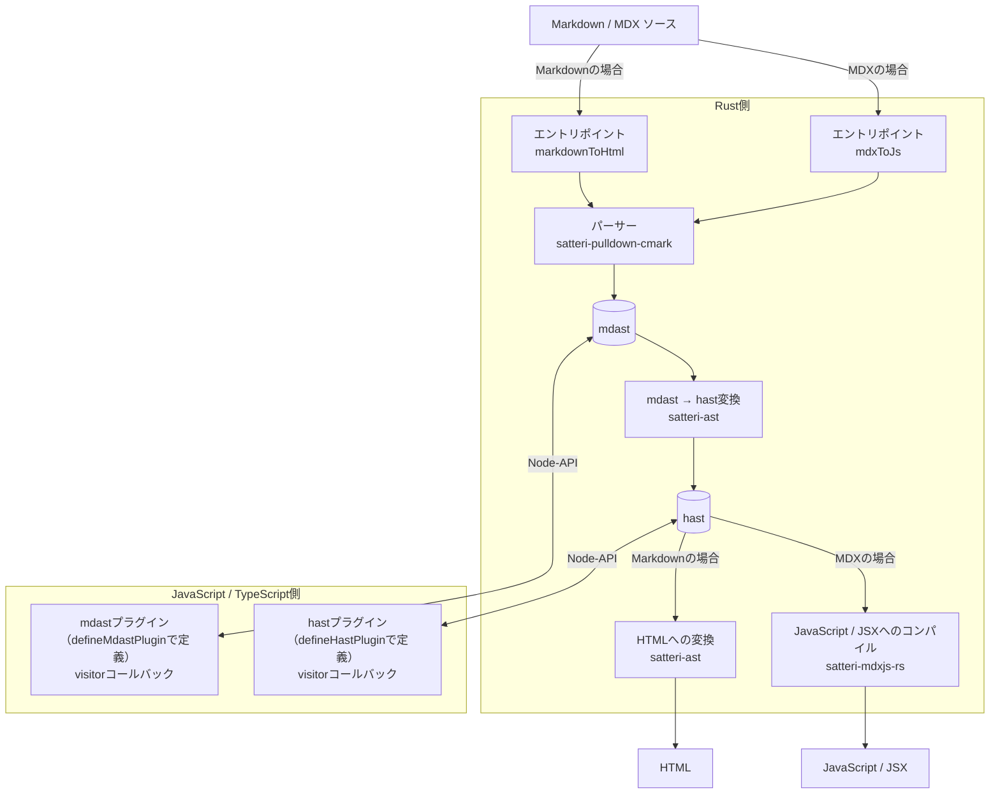
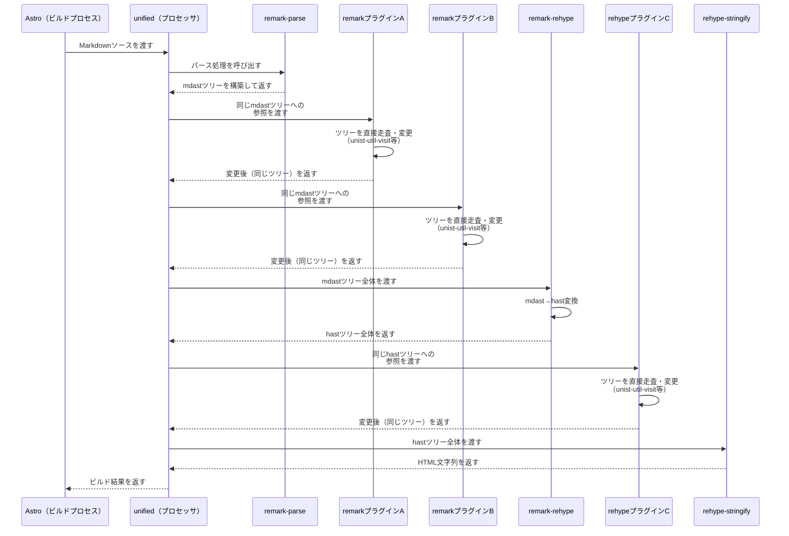
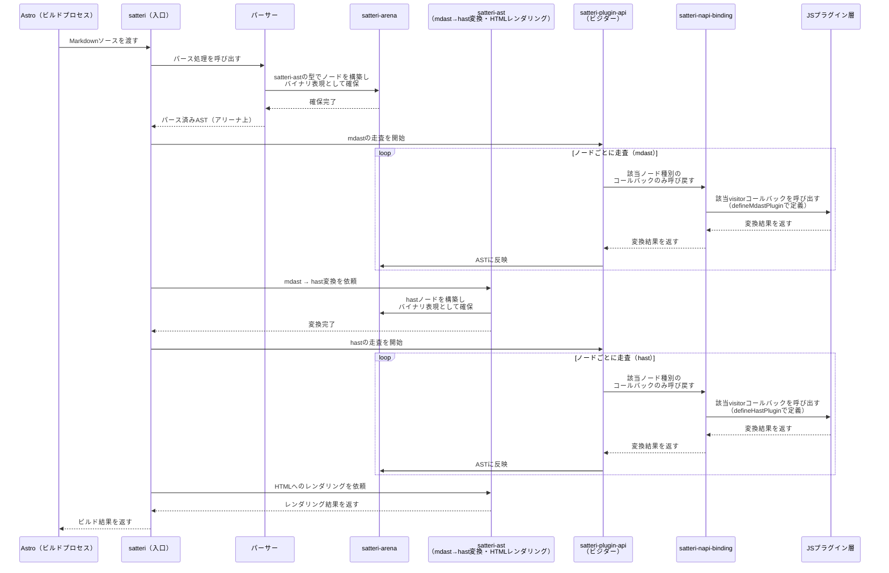

## はじめに

このサイトはAstro製なんですが，先月（2026年7月）末に作り始めたため，Astro v7を使っています。そのため，デフォルトのMarkdownプロセッサが unified (remark) から Sätteri に変わっています。

基本的にサイトの仕様変更とかはClaudeに任せているので，こちらとしては「ここをこうしたい」という要件だけ投げれば良いと思っていたんですが，ちょいちょいClaudeが「Sätteri がどうちゃらこうちゃらで～」みたいな話をしてくるんですよね。最初は「知らん。よしなにやってくれ」って感じだったんですが，修正が増えるにつれて，流石にある程度仕組みを理解しておかないと知らないうちに技術的負債が溜まってそうで怖いなーと思うようになりました。

で，とりあえず「Sätteri とは」でググってみたところ，日本語では Astro v6 → v7への移行関連の記事しかヒットしなかったので，「じゃあ自分で書くか」ということで筆を執った次第です。

## Sätteriとは何か

一言でいうと，Rust製の高速なMarkdown/MDXプロセッサです。パース・AST（構文木）の保持・変換・レンダリングまでをRustが担当し，プラグイン（変換処理）だけをJavaScript/TypeScriptで書く，という役割分担になっています。

| 項目          | 内容                                                  |
| ----------- | --------------------------------------------------- |
| 開発元         | bruits（Astroの中心コントリビューターの1人が，Astro組織の外で開発）          |
| 言語構成        | パース・AST保持・変換・レンダリング: Rust／プラグイン: JavaScript・TypeScript |
| Astroでの提供形態 | `@astrojs/markdown-satteri`パッケージ                    |
| Astroへの導入時期 | Astro 6.4で実験的導入 → Astro 7でコア依存（デフォルト）に              |
| リポジトリ       | [bruits/satteri](https://github.com/bruits/satteri) |

Astro本体とは別のリポジトリ・別の開発元で作られたプロジェクトが，Astroのコア依存に採用された，という成り立ちがまず面白いところです。

:::newbie
#### MDXって何？

という私のような方は↓こちらの記事をご参照ください。
[Markdown を拡張する MDX はドキュメント作成の新たな可能性？](https://zenn.dev/spring_raining/articles/3eb62ff93df1eb)

「そもそもJSXがわからないんですが……」という私のような方は↓こちらの記事もご参照ください。
[JSX でマークアップを記述する – React](https://ja.react.dev/learn/writing-markup-with-jsx)

ざっくり言うと，Markdownの中にJavaScriptが書けて，更にその中にHTMLが書けるってことみたいですね。初めて知ったけど普通に面白そう。
:::

### 名前の由来・読み方

Sätteriは，「印刷所のうち，植字・組版が行われる部門」を意味するスウェーデン語の名詞 sätteri から来ているっぽいです（公式からの説明はなし）。sätteri は「原稿を活字に組む」という意味を持つ動詞 sätta に，動詞から職業を表す名詞を作る接尾辞 -eri （英語における bakery の -ery と同じ）が付いた派生語で，sätta は英語の set と同語源らしいです。

[119-120 (Nordisk familjebok / Uggleupplagan. 28. Syrten-vikarna - Tidsbestämning)](https://runeberg.org/nfch/0078.html)

[sätta - Wiktionary, the free dictionary](https://en.wiktionary.org/wiki/s%C3%A4tta)

[-eri - Wiktionary, the free dictionary](https://en.wiktionary.org/wiki/-eri#Swedish)

（『Nordisk familjebok』はスウェーデンにおける権威ある百科事典とのことです）

読み方については，IPAの発音記号で \[ˌsɛtːəˈriː\] になる[^1]ので，カタカナ表記にするなら「セッテリー」になりそうです。

## なぜ生まれたのか

これまでAstroのMarkdown処理は，unified／remark／rehypeというJavaScript製のエコシステムを使っていました。プラグインが豊富で柔軟な反面，Markdownを1つ処理するたびにJavaScript側で何段もの変換処理（プラグインチェーン）を走らせる必要があり，記事数の多いサイトほどビルドが遅くなりがちという課題がありました。

Sätteriは，この「JS製エコシステムは柔軟だが遅い，Rustは速いがエコシステムが薄い」という対立を，パース・AST保持・mdast→hast変換・コンパイル/レンダリングまでをRust側に寄せ，プラグインだけをJavaScript/TypeScriptに残すことで解決しようとしたプロジェクトです。Astro公式は，Astro自身とCloudflareのドキュメントサイトをSätteriに切り替えたところ，それぞれビルド時間が1分以上短縮されたと報告しています。

## アーキテクチャ

SätteriはRustとTypeScriptのモノレポで構成されています。

[bruits/satteri: High-performance Markdown and MDX processing for the JavaScript ecosystem](https://github.com/bruits/satteri)

:::newbie
#### モノレポ……？

↓ここで詳しく解説されてました。別で開発してるWebアプリがPolyrepoで管理がめんどくさいと思ってたところだったので，これを気にMonorepoに移行しても良いかも。

[Monorepoって何なのか？と関連アーキテクチャとの関係をまとめてみた](https://zenn.dev/burizae/articles/c811cae767965a)
:::

主なクレート（≒ライブラリ），パッケージは次の通りです。

- `satteri`: Rust側の高レベルAPI（parse・convert・compileの入口）。
- `satteri-ast`: mdast/hastのノード型定義に加え，mdast→hast変換とhastからHTMLへのレンダリング処理自体も実装（`satteri-property-info`というHTML/SVG属性名マッピング用クレートに依存）
- `satteri-arena`: アリーナアロケータ（ノードごとにメモリを確保するのではなく，事前にガバっとまとめて確保したメモリ領域（＝アリーナ）を順次割り当て，用が済んだらまとめて解放する方式）とバイナリバッファ
- `satteri-plugin-api`: Rust側のプラグイントレイトと型付きビジター
- `satteri-napi-binding`: RustからJavaScriptへ公開するためのNAPIバインディング
- `satteri-pulldown-cmark`: CommonMarkパーサー（`pulldown-cmark`をMDX拡張対応にフォークしたもの）
- `satteri-mdxjs-rs`: MDX→JavaScriptコンパイラ（`mdxjs-rs`をOXC対応にフォークしたもの）

:::newbie
#### CommonMark……？

Markdownの標準仕様を定めるためのスペック（仕様）とのことです。↓こちらの記事が詳しいです。

[CommonMarkの仕様とか #Markdown - Qiita](https://qiita.com/Prof-Cheese/items/9629438b06aacc068c98)

CommonMarkには取り消し線など「Markdownに普通ありそう（主観）」な一部の機能が実装されていません。それを補うために，CommonMarkの拡張としてGFM（GitHub Flavored Markdown）などの「方言」が存在するということらしいです。↓この辺の記事が参考になりそう。

[CommonMark と GFM の違い (2026): テーブル拡張と 6 パーサー実測 | FormatArc](https://formatarc.com/ja/blog/commonmark-vs-gfm/)

[GitHub Flavored Markdown は何であって何でないか #CommonMark - Qiita](https://qiita.com/tk0miya/items/6b81e0e4563199037018)
:::

:::newbie
#### SWC……？Oxc……？？

どっちもRust製のJavaScript/TypeScriptコンパイラ（TypeScriptやJSXをJavaScriptに変換したり，JavaScriptを別のバージョンのJavaScriptに変換したりするツール）だそうです。

SWC（Speedy Web Compiler）はRust製JavaScript/TypeScriptコンパイラの走り的存在で，名前の通りそれまでのJS製コンパイラよりめっちゃ速いってことで人気を博しているっぽいです。

[Rust-based platform for the Web - SWC](https://swc.rs/)

[次世代のWebプラットフォームSWCを学ぶ #TypeScript - Qiita](https://qiita.com/k8o/items/563e99734850bb5b5723)

Oxc（Oxidation Compiler）は後発でSWCより更に速いそうです。「Oxidation（酸化）」は「Rust（錆）」と掛かっているんだと。オシャレですね。

[The JavaScript Oxidation Compiler](https://oxc.rs/)

[Oxc-Parserで爆速JavaScriptパース体験してきた話 | Easegis（イージース）](https://easegis.jp/blog/oxc-parser/)

最近開発しているChrome拡張機能は esbuild でコンパイルしているので，もし可能ならSWCやOxcを使ってみようかしら。
:::

処理の流れを図にすると，次のようになります。



Markdownのパース処理は`satteri-pulldown-cmark`（Rust製の高速CommonMarkパーサー`pulldown-cmark`をMDX拡張対応にフォークしたもの）が担い，`satteri`クレートの高レベルAPIから呼び出されて，GFM・frontmatter・数式・remark-directive形式のコンテナ記法などに対応しています。MDXについてもパースには`satteri-pulldown-cmark`が使われますが，通常のMarkdownとは別に`mdxToJs`という専用のentry pointが用意されており，最終的なJavaScriptへのコンパイルには`satteri-mdxjs-rs`が使われます。`satteri-mdxjs-rs`は`mdxjs-rs`をフォークしたもので，Markdown処理を`pulldown-cmark`ベースに，JavaScript ASTの処理・コード生成をSWCからOxcに置き換えています。

プラグインの仕組みはMarkdown側と共通です。パース結果は`satteri-ast`が定義するmdast/hastのノード型として組み立てられ，`satteri-plugin-api`が提供するRust側のビジター（型付き走査ロジック）がノードを巡回します。mdast→hast変換や，hastからHTML文字列へのレンダリングも，ノード型定義と同じ`satteri-ast`クレート内に実装されています。

プラグイン層がJavaScript側にある一方，AST自体は`satteri-arena`が確保するRust側のアリーナ（メモリ領域）上にバイナリ表現のまま保持され，`satteri-napi-binding`が用意するNode-API（旧称・N-API。Node.jsが提供する，JavaScriptからC/C++やRustなどで実装されたコードを呼び出すためのAPI）境界越しに必要な範囲だけJavaScriptとやり取りする作りになっています。この設計により，「JS側で書ける柔軟性」と「言語境界をまたぐコストの小ささ」を両立させているようです。

## remark/rehypeとの違い

SätteriのAST自体はmdast/hastというremark/rehypeと同じ形（ノードの種類や構造）を踏襲しています。ところが，プラグインAPIには互換性がありません。

remark/rehypeは`unified().use(plugin)`という形で，Middlewareのように複数のプラグイン関数を自由に連結できる汎用的な設計です。一方Sätteriにも`mdastPlugins`/`hastPlugins`という配列形式のオプションがあり，複数のプラグインを登録すること自体は可能です。ただし，Rust側のビジター走査ループが，登録されたノード種別ごとのコールバックだけをJavaScript側に呼び戻す方式になっているため，`remark-math`や`rehype-katex`のような既存のremark/rehypeプラグインをそのまま`mdastPlugins`に渡す，といったAPIレベルの互換性はありません。

まず，従来のremark/rehype（unified）の場合の呼び出しの流れを図にすると，次のようになります。



各プラグインは同じASTツリーへの参照を順番に受け取り，その場で走査・変更しながら次のプラグインへ処理を渡していく，という流れになっています。

これに対して，Sätteriの場合は次のようになります（MDXもパース自体は`satteri-pulldown-cmark`が行い，最終的なJavaScriptへのコンパイルだけ`satteri-mdxjs-rs`が担う形ですが，ここではMarkdown処理のフローに絞って比較します）。



`unified().use(plugin)`のようなAPI互換のプラグイン連結ではなく，`satteri-plugin-api`のビジターがノードの走査・プラグイン呼び出しの主導権を握り，`satteri-napi-binding`を経由してノード単位でJavaScript側（`mdastPlugins`/`hastPlugins`に登録されたプラグイン）を呼び出す，という向きの違いがこの図から見て取れると思います。

このような違いがあるため，既存プラグインを使いたい場合はSätteri独自のプラグインAPI（`defineMdastPlugin`/`defineHastPlugin`）で書き直す必要があります。なお，主要なremark/rehypeプラグインをSätteri向けに移植するコミュニティプロジェクトも存在するので，まず自作する前に一度探してみる価値はありそうです。

[Ashish-CodeJourney/satteri-plugins: Ports of remark and rehype plugins to Sätteri, the Rust markdown engine behind Astro 7.](https://github.com/Ashish-CodeJourney/satteri-plugins)

## パフォーマンス

Astro公式によると，Astro 7ではSätteriの採用を含む複数の高速化施策によって，Astro 6と比較して全体のビルド時間が15〜61%短縮されています。Sätteri単体についても，AstroとCloudflareのドキュメントサイトを従来のunifiedベースのMarkdown処理系からSätteriへ切り替えたところ，それぞれビルド時間が1分以上短縮されたと報告されています。

[Astro 7.0 | Astro](https://astro.build/blog/astro-7/?utm_source=chatgpt.com)

Sätteriが高速な理由の一つは，GFMのテーブル・タスクリスト・オートリンク・取り消し線といった機能が，JavaScriptプラグインによる後段の処理ではなく，Rust側のパーサーに組み込まれていることです。

また，上で見たようにプラグインの実行方法にも違いがあります。remark/rehypeでは，各プラグインが`unist-util-visit`などを使ってJavaScript側でASTを走査するのが一般的ですが，SätteriではASTの走査自体をRust側のビジターが担当し，プラグインが処理対象として登録した種類のノードだけをJavaScript側のコールバックに渡します。つまり，プラグインを利用する場合でも，JavaScript側でAST全体の走査を繰り返す従来の仕組みとはコスト構造が異なります。

ただし，Astro公式が示している15〜61%という数値はSätteri単体のベンチマークではなく，Astro 7全体で行われた複数の高速化を合わせた結果です。また，プラグインの数や処理内容によってSätteri単体の高速化率がどの程度変化するかについても，具体的なベンチマークは示されていません。あしからず。

## Astroでの使い方

Astro 6.4で導入された`markdown.processor`という設定項目により，Markdown処理系を差し替えられるようになりました。Sätteriを明示的に使う場合は，`astro.config.mjs`で次のように設定します。

```js
import { defineConfig } from "astro/config";
import { satteri } from "@astrojs/markdown-satteri";

export default defineConfig({
  markdown: {
    processor: satteri({
      features: { math: true },
    }),
  },
});
```

とはいえAstro 7では`@astrojs/markdown-satteri`がデフォルトのMarkdownプロセッサとして最初から使われるため，プラグインを使わないシンプルなブログであれば，`markdown.processor`を明示的に設定する必要すらありません。数式やカスタムプラグインなど，個別の機能を使いたい場合にだけ，上記のように`processor: satteri({...})`を明示的に設定してオプションを渡す形になります。

## 採用する際の注意点

一番の注意点は，やはり既存のremark/rehypeプラグイン資産です。ただし，GFM（テーブル・脚注・取り消し線・タスクリストなど）はSätteri本体にデフォルトで実装されているため，`remark-gfm`は移行時には不要になります。

一方，Sätteriの`features: { math: true }`は数式記法をパースして`math` / `inlineMath`ノードとしてASTに組み込む機能であり，KaTeXによる数式の描画まで行うものではありません。そのため，従来`rehype-katex`などで数式を描画していたサイトでは，Sätteriへの移行時に同等の処理をSätteri対応プラグインなどで別途用意する必要があります。

判断の目安としては次のようになりそうです。

- プラグインをほとんど使っていない，またはGFM・frontmatter・数式パースなど標準機能の範囲で足りている → ほぼそのままSätteriに乗り換えられる
- 使っているプラグインが前述のコミュニティ移植プロジェクトでカバーされている → 差し替えるだけで済む可能性がある
- 独自プラグインや，移植されていないニッチなプラグインに依存している → Sätteri独自のプラグインAPIで書き直す必要がある

3つ目のケースについては，実際に数式・外部リンクカード化などのプラグインを自作した際の実装知見を別記事にまとめる予定です。

## まとめ

- Sätteriは，パース・AST保持・変換・レンダリングまでをRust，プラグインだけをJS/TypeScriptに分離した高速Markdown/MDXプロセッサで，Astro 7のデフォルトエンジンになっている
- 生まれた背景は，JS製Markdownパイプラインのビルド速度の限界。Sätteri単体でも，AstroとCloudflareのドキュメントサイトでそれぞれビルド時間が1分以上短縮されたと報告されている
- ASTの形（mdast/hast）はremark/rehypeを踏襲しているが，プラグインAPIには互換性がない
- 既存プラグイン資産への依存度が，Sätteri移行のハードルをそのまま左右する

## 参考

- [Astro 6.4 (Astro公式ブログ)](https://astro.build/blog/astro-640/)
- [Astro公式X投稿](https://x.com/astrodotbuild/status/2069960028480586054)
- [Sätteri公式ドキュメント](https://satteri.bruits.org/docs/)
- [Astro 6.4リリース。プラグ可能なMarkdownパイプラインとRust製プロセッサーSätteriが登場 (A&Gウェブ)](https://www.aandgweb.co.jp/astro-6-4-release/)
- [Astro v6 から v7 へのアップグレード | grip on minds](https://griponminds.jp/blog/astro-v7/)
- [Westerlund, Rune. 2010. _Ljudstrukturen i dialekten i Rödåliden: Auditiv analys av fonemen i en norrländsk dialekt i början av 2000-talet_. Umeå universitet.](https://www.diva-portal.org/smash/get/diva2%3A413991/FULLTEXT01.pdf)

[^1]: IPA表記はErik Andersson (1994, p.274)における記載をRune Westerlund (2010, p.33)から孫引き。
