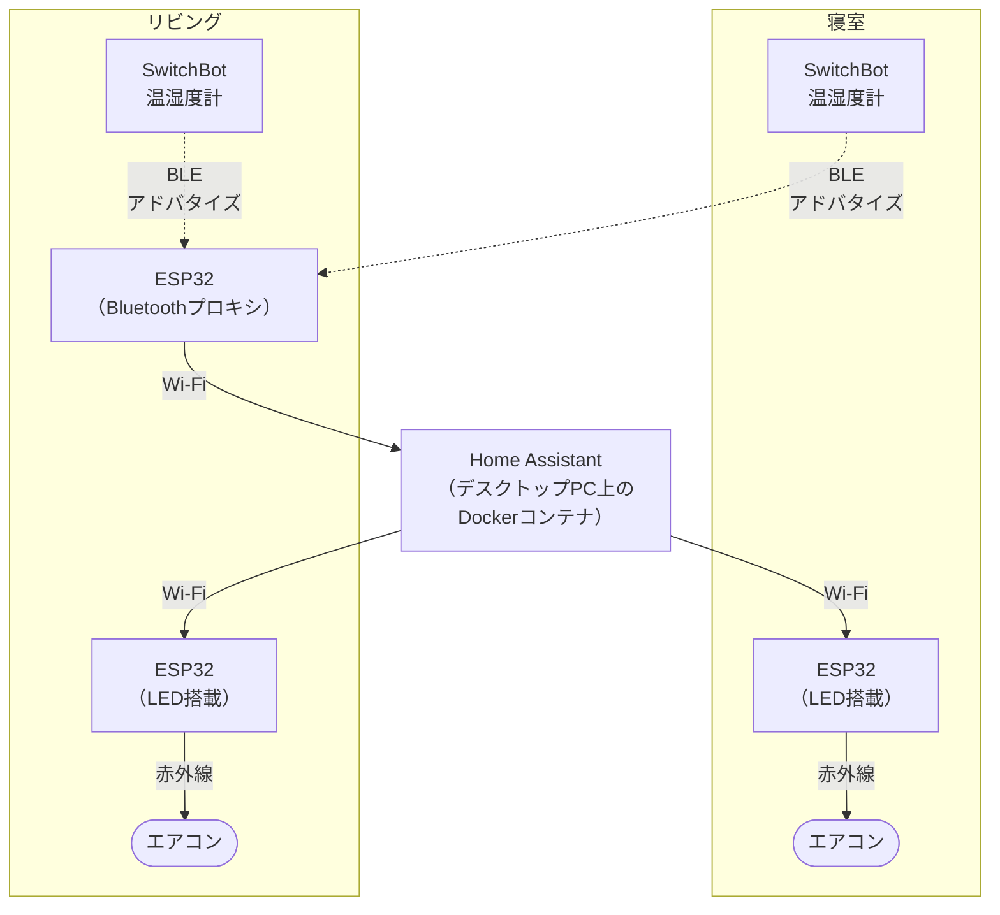

## この記事について

これは「ESP32でエアコンをIoT化する」シリーズの1本目です。今回はまだ配線もESPHomeの設定も出てきません。「そもそもどういう構成で実現するか」を決めるまでの話です。

次回以降でセットアップ編，赤外線送信トラブルシューティング編，自動化＆Bluetoothプロキシ編と続く予定です。

## 発端

去年冬の湿度管理のためにSwitchBot温湿度計を購入した辺りから意識はしていたんですが，新生児と暮らすようになってより繊細な温湿度管理が必要になったこともあり，この夏にエアコンのIoT化を進める決意をしました。

要件としては，

- 部屋の温度・湿度を自動で適切な値に保ちたい。
  - ずっと同じ設定で動かしていると次第に寒くなったり暑くなったりするため頻繁にリモコンを操作しないといけないのも大変だし，寝ている時に暑さ／寒さで目が覚めるのもQOLを損なう。
- 点け忘れ，消し忘れが無いよう，起動・終了も自動化したい。
- 旅行など長時間の外出をする際，家の外からエアコンを操作して到着した時点で快適な温度になっているようにしたい。

といった感じです。IoT初心者なので，最初はどうすれば実現できるかChatGPTに相談して大まかな設計をしてから着手しました。

## 検討した2つの案

### 案1: SwitchBot Hubを追加するだけで完結させる

一番手軽なのは，やっぱりSwitchBot Hub2（定価 ¥9,980）を追加することですよね。これだけで温湿度計とエアコンの赤外線リモコンをSwitchBotアプリ上でつなげられます。

- 温度が28℃を超えたら冷房ON
- 温度が26℃を下回ったら冷房OFF
- 湿度が70%を超えたら除湿ON
- 帰宅（ジオフェンス）で冷房ON

といったルールがアプリの画面だけで組めます。Hub2はMatter（CSAが策定したスマートホームのためのIoT共通規格）対応のため，例えばApple Homeと連携してiPhoneから機器を操作できるような構成を簡単に組める点も魅力です。

[スマートホームの新規格「Matter」を解説。スマートホーム市場に与える影響とは - SpaceCore（スペースコア）](https://space-core.jp/media/10032/)

ただし，エアコンについてはMatter経由だとON/OFF・冷暖房切替・温度設定はできるものの，除湿・送風モードや風量・風向の調整まではできないようです（未検証）。

[SwitchBot Hub 2の赤外線リモコンがMatter対応 | DIY Smart Matter](https://diysmartmatter.com/archives/3106)

ちなみに，私のように既に温湿度計を持っている場合はHub Mini（定価 ¥5,480）という選択肢もあります。これはMatterに対応していない機種ですが，それに数百円積めばHub Mini Matter対応（定価 ¥5,980）というやつもあります。

↓商品一覧

[SwitchBotホームオートメーション - あなたの家を最先端のスマートホームへ – SwitchBot (スイッチボット)](https://www.switchbot.jp/collections/home-automation)

### 案2: ESP32 + Home Assistant

もう一つの案が，ESP32というマイコンを赤外線リモコン代わりに使い，Home Assistantで一元管理する構成です。SwitchBot Hubのようにメーカー製の完成品を使うのではなく，自分でハードウェアを組んだりソフトウェアを書いたりする方向になります。

[ESP32 Wi-Fi & Bluetooth SoC | Espressif Systems](https://www.espressif.com/ja-jp/products/socs/esp32)

他のマイコンとの比較は下表の通りです[^1](以下の情報を元に作成。価格は純正品のものを記載。)。正直ChatGPTに相談した時はESP8266は候補として挙がっていなかったんですが，こうして見ると後述のBluetoothプロキシ以外の用途ではESP8266を使った方がコスパが良かったですね……今後に活かそうと思います。

| 項目 | ESP32 DevKitC | Raspberry Pi Pico W | Arduino Uno R4 WiFi | ESP8266 (NodeMCU) |
| --------------------- | ---------------------------- | ------------------- | ------------------------------------ | ----------------------------- |
| 価格目安 | ¥1,800 | ¥1,200程度 | ¥5,500 | ¥1,000程度 |
| Wi-Fi | ○ | ○ | ○（ESP32-S3を通信用に内蔵） | ○ |
| Bluetooth | ○ | ○（チップ的には対応） | ○（同上） | × |
| Home Assistant連携のしやすさ | ◎ ESPHomeでYAML設定のみ，コード不要 | △ MQTT等を自前で実装する必要あり | △ MQTT等（ArduinoHAライブラリ等）を自前で実装する必要あり | ○ ESPHomeでYAML設定のみ，コード不要（旧世代） |
| 赤外線送受信の相性 | ◎（RMTという専用ハードウェアがありタイミングが安定） | △（対応はしているが実績が浅い） | ― | ○ |

Home Assistantは，Python製のOSSスマートホームオートメーションプラットフォーム（長い）です。要するに，SwitchBot，Philips Hue，Nature Remoなどメーカーがバラバラな機器を1つのダッシュボードと自動化ルールの下に集約できるプラットフォームということです。SwitchBotアプリのようにクラウド上で動くサービスではなく，自分の家のサーバー（PCやRaspberry Pi等）上で動かすソフトウェアなので，外部のクラウドに頼らずローカルだけで動かせるのも特徴です。

また，Matterコントローラーとしての機能も持っていて，案1で触れたSwitchBot Hub2のようなMatter対応機器も，このHome Assistant配下に取り込めます。

[Home Assistant](https://www.home-assistant.io/)

[はじめてのHome Assistant｜特徴とインストール方法をわかりやすく紹介 – X SIGHT Online Media](https://media.xsight.co.jp/article/663)

## 最終的な構成

最終的に選んだのは案2，ESP32 + Home Assistantでした。理由は大きく2つあります。

**コスト**

赤外線が壁をすり抜けない以上，スマートリモコンは部屋ごとに1台置く必要があり，少なくとも寝室とリビングの2箇所には置きたいと考えた時，SwitchBot Hub2なら2万円，Hub Miniでも1万円以上掛かる計算になります。将来的に他の部屋にもスケールしていくかもと考えた時，このコストはちょっと足踏みするな～と思いました。正直これが決め手ですね。

**実績のある構成**

ESP32+Home Assistantの構成はめちゃくちゃ定番で知見がたくさんあるとのことだったので，私自身は初心者でも「まぁClaude Codeに任せればなんとかなるだろう」という安心感が持てたことも，こっちを選ぶ後押しになりましたね。

で，最終的な構成はこうなりました。

SwitchBot Hubとクラウドサーバの代わりに，ESP32とHome Assistantを置いているって感じですね。

ちなみに当初はデスクトップPCでSwitchBotからセンサーデータを受け取れると思ってたんですが，色々あって結局Bluetoothプロキシ専用のESP32を追加で置くことになりました。この辺の経緯は次回以降の記事で語ろうと思います。

## 材料費

参考までに，今回のエアコン2台分の自動化で買ったものと，実際に使った部品の原価をまとめておきます。

**買ったもの**

- 抵抗セット（1R〜1M，30種類×各20個入り，計600pcs）¥590
- ELEGOO Arduino用ブレッドボード（830タイポイント，3枚セット）¥900
- VKLSVAN 赤外線受信機30個＋赤外線LED30個セット（合計60個）¥795
- ジャンパーワイヤー（オス-オス／オス-メス／メス-メス混合，20cm，120本セット）¥660
- Freenove ESP32開発ボードキット（2個パック）×2セット（計4台，うち3台使用，1台予備）¥5,160
- サンハヤト ニューブレッドボード SAD-101（1枚）¥2,133
- トランジスタ 2SC1815-GR（10個入り）¥390

**実際に使った分**

エアコン2台分の回路に実際に使ったのは，このうち以下の数量です。

| 部品 | 使用数 | 使用分の原価 |
| ------------- | --------------- | ----------- |
| ESP32 | 3台 | ¥3,870 |
| ジャンパーワイヤー | 4本 | ¥22 |
| 赤外線LED | 2個 | 約¥27 |
| 抵抗 | 4本（100Ω，1kΩ各2本） | 約¥4 |
| トランジスタ | 2個 | ¥78 |
| ELEGOOブレッドボード | 2枚 | ¥600 |
| サンハヤトブレッドボード | 1枚 | ¥711 |
| **合計** |  | **約¥5,312** |

Bluetoothプロキシ用のESP32は寝室・リビング共通の設備なので，2台で按分しました。共通設備のESP32（¥1,290）を2等分して，各エアコンに¥645ずつ配賦（←Claudeの誤字かと思ったられっきとした経理用語なんですね。疑ってすいません）しています。

[配賦とは？按分・割賦との違いや基準、効率化させるポイントまでわかりやすく解説 | 経営者から担当者にまで役立つバックオフィス基礎知識 | クラウド会計ソフト freee](https://www.freee.co.jp/kb/kb-hanbai-kanri/allocation/)

| 対象 | 専用回路 | Proxy按分 | ブレッドボード | 合計 |
| -------------------------------------------------------------------------------------------------------------------------------------------------------------------------------- | ------- | ------- | --------------- | ------- |
| 寝室 | 約¥1,356 | ¥645 | ¥600（ELEGOO 2枚） | 約¥2,601 |
| リビング | 約¥1,356 | ¥645 | ¥711（サンハヤト1枚） | 約¥2,712 |

実際の購入金額だけ見るとほぼHub Mini×2と同じ金額ですが，まぁ同じスマートリモコンもう1台作れるだけの部品余ってるし，ブレッドボードも最初からサンハヤトのを買っていればもっとコスト抑えられたし，ESP32……じゃなくてESP8266さえ追加購入すればもっと作れるし，とか考えるとやっぱお得かなと。ていうかそうじゃないと自作する意味ないですしね。

## 次回予告

構成は決まりましたが，これはまだ「方針」の話でしかありません。図を描いただけではエアコンの1台も動きませんし，赤外線LEDの1つも光りません。次回はESPHomeの設定とESP32のセットアップから始めて，実際にブレッドボードで赤外線送受信の回路を組む，セットアップ編に進みます。

……ってClaudeが言ってます。なんかカッコつけがちですね。では。

[ESP32-DevKitC-32E - 秋月電子通商](https://akizukidenshi.com/catalog/g/g115673/)  
[Raspberry Pi Pico W: 開発ツール・ボード 秋月電子通商-電子部品・ネット通販](https://akizukidenshi.com/catalog/g/g117947/)  
[Arduino Uno R4 WiFi - スイッチサイエンス](https://www.switch-science.com/products/9090)  
[Remote Transmitter - ESPHome公式ドキュメント](https://esphome.io/components/remote_transmitter/)  
[RP2040: Add remote_transmitter component - GitHub PR](https://github.com/esphome/esphome/pull/5974)  
[Raspberry Pi Pico Wで赤外線受信をやってみる - からくり無者](https://karakuri-musha.com/inside-technology/arduino-raspberrypi-picow-tips-irreceive-module01/)